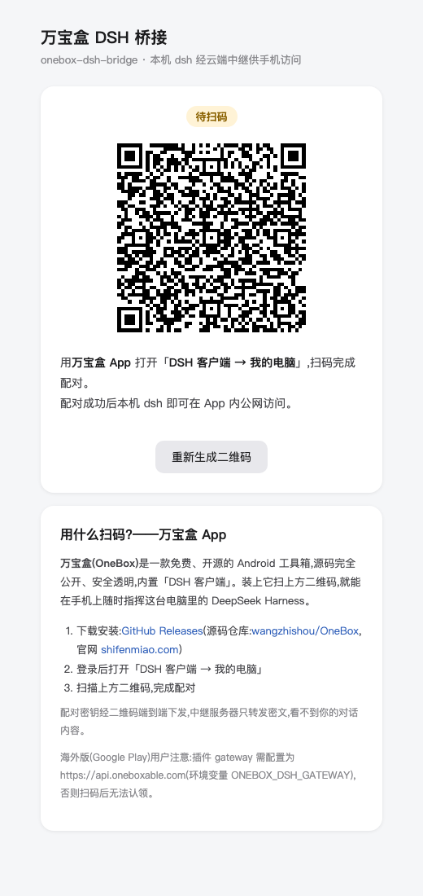
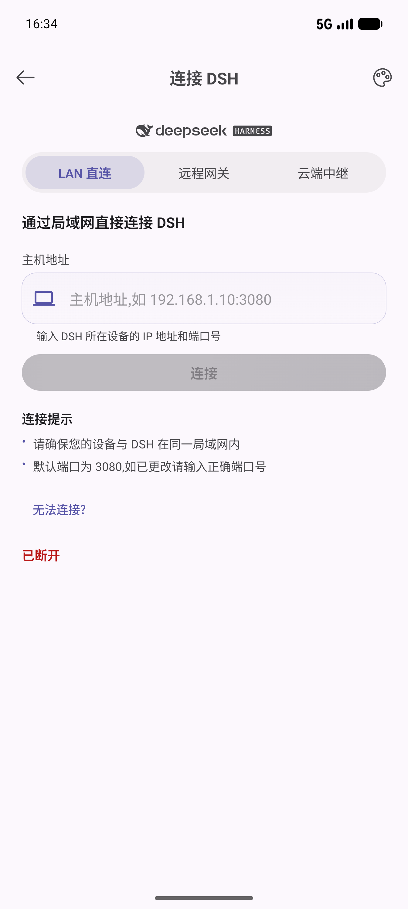
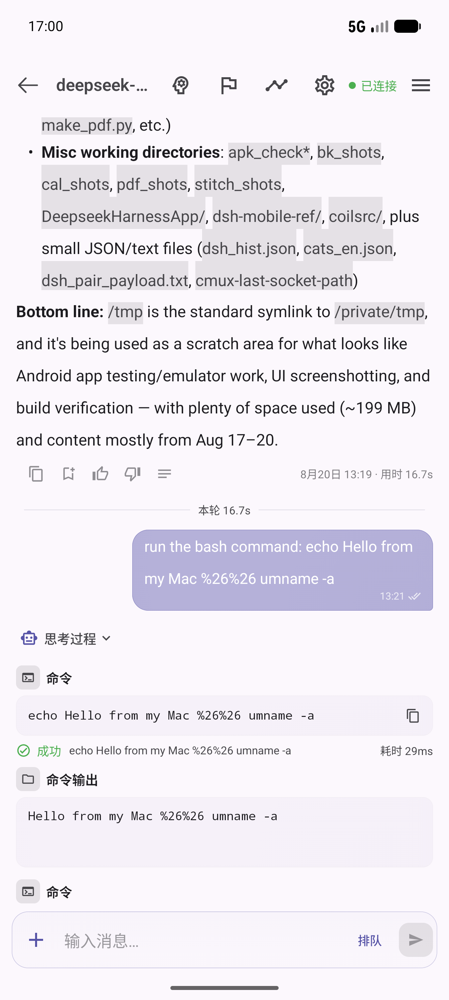
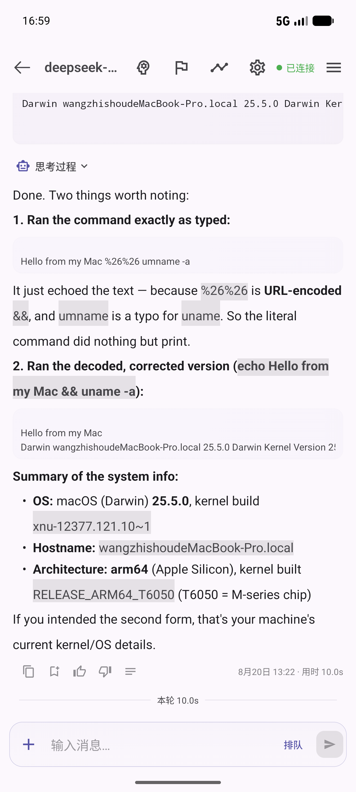

# onebox-dsh-bridge

万宝盒云端中继桥 —— DeepSeek Harness(dsh)插件。让本机 `dsh web` 经万宝盒云端中继(`https://api.wanbaohe.com` 的 `/dsh/*` 路由)被手机上的万宝盒 App 公网访问。是 Go 版 CLI(`strapi_go/cmd/dsh-connector`)的插件化替代:扫码配对、token 管理、隧道帧多路复用全部在插件内完成,dsh web 启动即在线。

## 工作原理

```
万宝盒 App ⇅ https://api.wanbaohe.com/dsh/*(strapi_go 中继)
                    ⇅ 出站 WSS(控制隧道,JSON 帧多路复用)
            onebox-dsh-bridge(本插件)
                    ⇅ loopback
            本机 dsh web(127.0.0.1:3080)
```

- 插件在 dsh web GUI 挂 `/onebox-bridge` 页面(自包含 HTML,无外部依赖),显示配对二维码与在线状态
- 配对走 `POST /dsh/pair-sessions` → 本地生成 ≥128bit secret 编入 QR(`oneboxdsh://pair?v=1&g=…&p=…&s=…`)→ 2s 轮询 `GET /dsh/pair-sessions/:id/status?s=…`,App 扫码 claim 后取回设备 token
- 上线走出站 WSS `/dsh/agent?token=…`;隧道帧:`http`→ 本地 `POST /api/<method>` 回 `http-resp`;`ws-open`/`ws-frame`/`ws-close` 桥接本地 `/api/events.mux|host`
- 控制 WS 断开 → 关闭全部本地桥接,指数退避重连(1s→30s);token 401(失效/被吊销)→ 删除本地 token,自动回到扫码配对态

## 安装

已安装 dsh CLI:

```sh
dsh plugin --profile web add /path/to/onebox-dsh-bridge
```

源码检出运行 dsh 的(命令前缀换成 `pnpm dsh`,在 deepseek-harness 仓库根目录执行):

```sh
pnpm dsh plugin --profile web add /path/to/onebox-dsh-bridge
```

包声明了 `dsh.bundle`,`add` 会自动把插件行并入 profile 的组合层。重启 `dsh web` 生效。

## 使用

1. 打开 dsh web 的 `http://127.0.0.1:3080/onebox-bridge`(端口按你的部署)
2. 万宝盒 App 打开「DSH 客户端 → 我的电脑」,扫页面上的二维码
3. 页面状态变为「已上线」后,在 App 里选择本设备即可连接

页面按钮:**重新生成二维码**(旧会话作废,建新配对会话;二维码有效期 10 分钟,过期也会自动重建)、**解除绑定并重新配对**(删除本地 token,回到待扫码)。

## 截图

| 插件配对页 | App 连接页 | App 聊天指挥 | 消息反馈与统计 |
|---|---|---|---|
|  |  |  |  |

## 配置项

全部可省。优先级:环境变量 > 插件 config > 默认值。

| 项 | 环境变量 | 默认 | 说明 |
|---|---|---|---|
| `gateway` | `ONEBOX_DSH_GATEWAY` | `https://api.wanbaohe.com` | 万宝盒网关地址。**海外版 App(Google Play 渠道,走 api.oneboxable.com)必须改成 `https://api.oneboxable.com`**,否则 App 扫码后认领到国内库、登录态对不上 |
| `upstream` | `ONEBOX_DSH_UPSTREAM` | `127.0.0.1:3080` | 本机 dsh 地址(host:port) |
| `deviceName` | — | 系统 hostname | 配对时上报给 App 的设备名 |
| `dataDir` | `ONEBOX_DSH_DATA_DIR` | `~/.dsh/profiles/web/onebox-dsh-bridge` | token 存储目录(token.json,0600;网关变更后旧 token 自动作废) |

改 config:在 profile 的 `~/.dsh/profiles/web/cordis.patch.yml` 里覆盖整行(patch 替换整个 config 值,需列全所有键):

```yaml
- id: onebox-dsh-bridge
  name: 'onebox-dsh-bridge'
  config:
    gateway: https://api.wanbaohe.com
    upstream: 127.0.0.1:3080
    deviceName: 我的 Mac
```

## 卸载

```sh
dsh plugin --profile web remove onebox-dsh-bridge
```

按需手动删除凭据目录 `~/.dsh/profiles/web/onebox-dsh-bridge/`;已配对的设备可在 App 端「我的电脑」里吊销。

## 注意

- `/onebox-bridge` 页面与 dsh web 本身一样不做额外鉴权(默认仅 loopback 可达);二维码内含配对 secret,不要把 dsh web 直接暴露到公网
- 插件依赖仅 `ws` + `qrcode`
